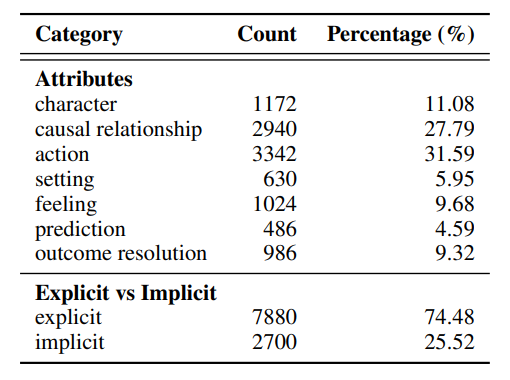
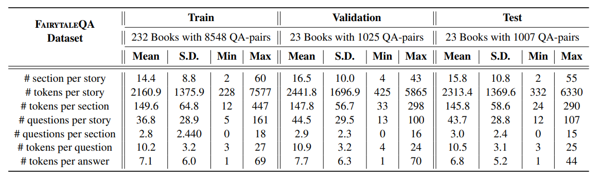
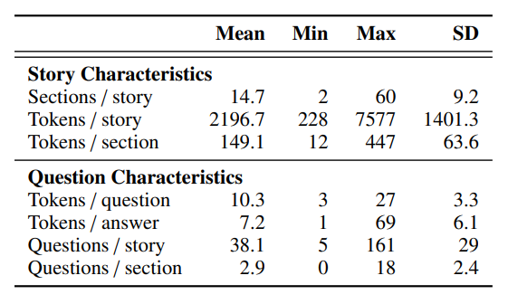
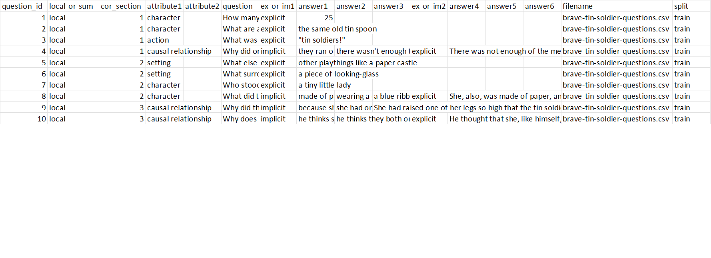

# FairytaleQA: A Dataset for Question and Answer Generation

This repository contains the FairytaleQA dataset for our paper: [```Fantastic questions and where to find them: FairytaleQA -- An authentic dataset for narrative comprehension.```](https://arxiv.org/abs/2203.13947) [Accepted to ACL 2022]

The FairytaleQA dataset contains CSV files of 278 children's stories from [Project Gutenberg](https://www.gutenberg.org/) and a set of questions and answers developed by educational experts based on an evidence-based theoretical framework. This dataset focuses on narrative comprehension of kindergarten to eighth-grade students to facilitate assessment and training of narrative comprehension skills for both machines and young children. 

## Dataset Statistics

<!--  -->
<!--  -->
<!--  -->

<p align="middle">
    
    
</p>

The table on the left is the core statistics of the FairytaleQA dataset. The table on the right is the breakdown statistics of QA-pairs (question-answer pairs) in FairytaleQA dataset based on the 7 narrative elements' schema.

<!-- 

Above is the core statistics of the FairytaleQA dataset. 


Above is the breakdown statistics of QAs in FairytaleQA dataset based on the 7 narrative elements' schema. -->


Above is the statistics of the FairytaleQA dataset by train/test/val splits.


## Repository Structure

We have two different split methods for the dataset, one is to split the stories by their origins(```./data-by-origin```), the other is to split the stories into train/val/test for fine-tuning a model(```./data-by-train-split```). We randomly split the stories into train/test/val and provide the core statistics of each split above. 

In either split approach, each story has **two** primary files : 
- The story content (```../section-stories```). Eeach line is a section determined by human coders which contains multiple paragraphs. 
- The education experts labeled QA-pairs (```../questions```). Each line is a QA-pair that is linked to one or more sections (shown by ```cor_section``` in question files which can be mapped to ```section``` in story section files)

We further provide a **third** file for each story (```../sentence-stories```) that breaks down the stories into sentences in favor of further detailed analysis on sentence-levels. Each line is a sentence in this story. We use Spacy English pipeline [```en_core_web_sm```](https://spacy.io/models/en) as the sentencizer.  

*For example, story ```ali-baba-and-forty-thieves``` has the following files in origin split: 
```./data-by-origin/questions/first-round/ali-baba-and-forty-thieves-questions.csv```,
```./data-by-origin/section-stories/first-round/ali-baba-and-forty-thieves-story.csv```, and 
```./data-by-origin/sentence-stories/first-round/ali-baba-and-forty-thieves-story.csv```. The stories are organized in the same way by train/test/val split.*

We also provide a meta data file ```story_meta.csv``` for our dataset which contains the list of stories and their corresponding metadata. This can be useful for traversing or filtering the dataset.


## Using this Dataset

To start with this dataset, either clone the repo or download it as a zip file.

`starter.py` contains some starter code that can retrieve and aggregate the QA pairs or the stories. Example output from `get_question_df` is below. These functions are useful for people who want to handle to data for general purposes. For NLP preprocessing, [go to this Jupyter notebook](https://github.com/WorkInTheDark/FairytaleQA_QAG_System/blob/main/0_Pre_processing_the_original_data.ipynb).

<p align="middle">
    
</p>

## Related Work

In a concurrent work, we use this dataset to build a QA-pair Generation (QAG) System. You can also find some Jupyter Notebooks to train and run models [here](https://github.com/WorkInTheDark/FairytaleQA_QAG_System). This work [```It is AI's Turn to Ask Humans a Question: Question-Answer Pair Generation for Children's Story Books```](https://arxiv.org/abs/2109.03423) is accepted to ACL 2022.

We also leveraged the QAG System to build an interactive storytelling system that allows parents to collaborate with AI system in creating storytelling experiences with interactive question-answering for their children. This work [```StoryBuddy: A Human-AI Collaborative Chatbot for Parent-Child Interactive Storytelling with Flexible Parental Involvement```](https://arxiv.org/abs/2202.06205) is accepted to CHI 2022.

A group of researchers aimed to generate educational meaningful and high-cognitive-demand questions. They used this dataset to train a novel model architecture that can take into account of a summary of the salient events, and a learnable distribution of the question types. There work [```Educational Question Generation of Children Storybooks via Question Type Distribution Learning and Event-Centric Summarization```](https://arxiv.org/abs/2203.14187) is accepted to ACL 2022.  And their code is available [here](https://github.com/zhaozj89/Educational-Question-Generation).

## Future Work

We are working on exploring the influence of various social biases from the stories to SOTA neural models, we plan to further annotate the dataset for various social biases found in the stories.

## Citation
Our Dataset Paper is accepted to ACL 2022, you may cite:
```
@inproceedings{xu2022fairytaleqa,
    author={Xu, Ying and Wang, Dakuo and Yu, Mo and Ritchie, Daniel and Yao, Bingsheng and Wu, Tongshuang and Zhang, Zheng and Li, Toby Jia-Jun and Bradford, Nora and Sun, Branda and Hoang, Tran Bao and Sang, Yisi and Hou, Yufang and Ma, Xiaojuan and Yang, Diyi and Peng, Nanyun and Yu, Zhou and Warschauer, Mark},
    title = {Fantastic Questions and Where to Find Them: Fairytale{QA} -- An Authentic Dataset for Narrative Comprehension},
    publisher = {Association for Computational Linguistics},
    year = {2022}
}
```
